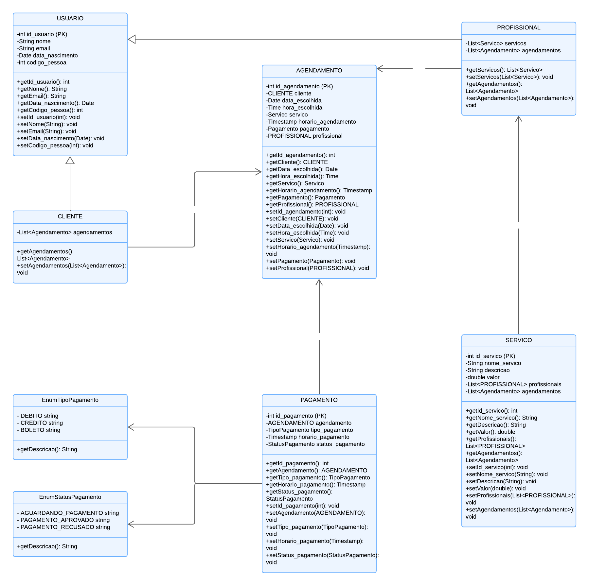
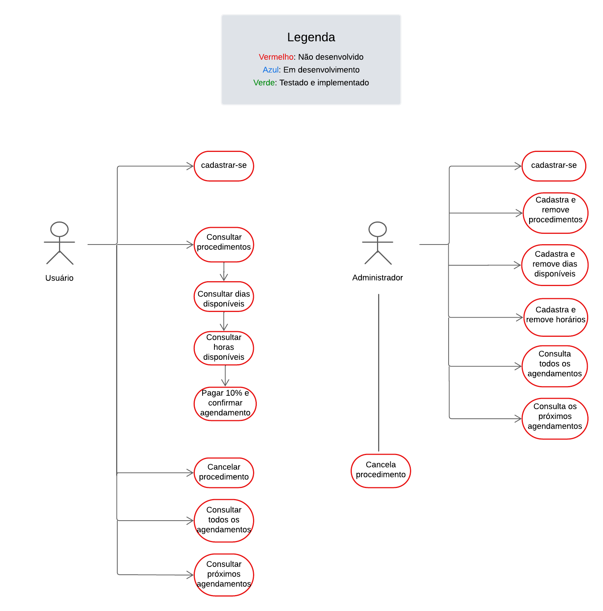

# Sistema de Agendamento
**Objetivo:** Desenvolver um sistema de agendamento online que permita aos usuários marcar eventos ou procedimentos com profissionais de forma totalmente virtual. O sistema deve incluir a opção de pagamento antecipado de 10% do valor total do serviço, com a política de reembolso não aplicável para cancelamentos feitos dentro das 24 horas anteriores à data agendada.

## Resumo técnico
**Resumo:** 

## Diagrama de classes

## Diagrama de caso de uso

## Endpoints disponíveis

--

## Tecnologias utilizadas

--

## Conceitos abordados

--

##  Variáveis necessárias para rodar o projeto localmente

 Variável      | Valor                               | Observação                                                              |
|---------------|-------------------------------------|-------------------------------------------------------------------------|
| `DB_JDBC_URL` | jdbc:mysql://localhost/agendamentos | Necessário criar o schema 'agendamentos' no banco de dados MySQL        |
| `DB_USUARIO`  | ?                                   | Preencher com o nome do seu usuário root ou outro que esteja utilizando |
| `DB_PASSWORD` | ?                                   | Preencher com a senha do seu usuário                                    |

